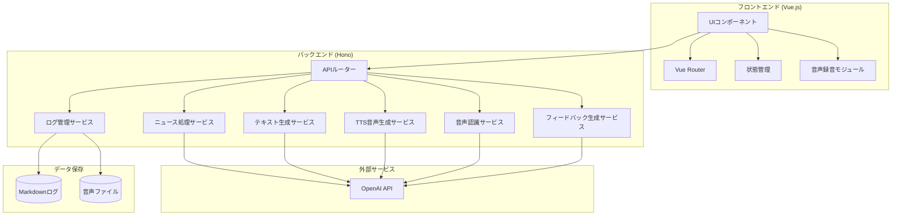
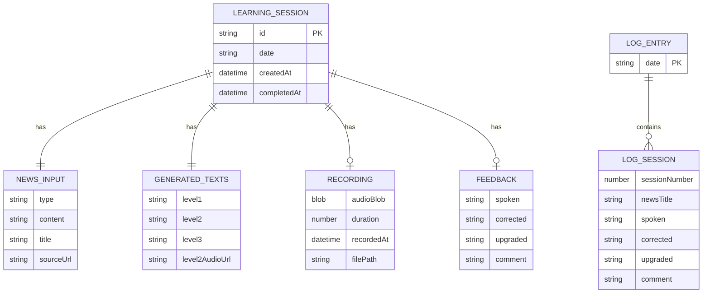
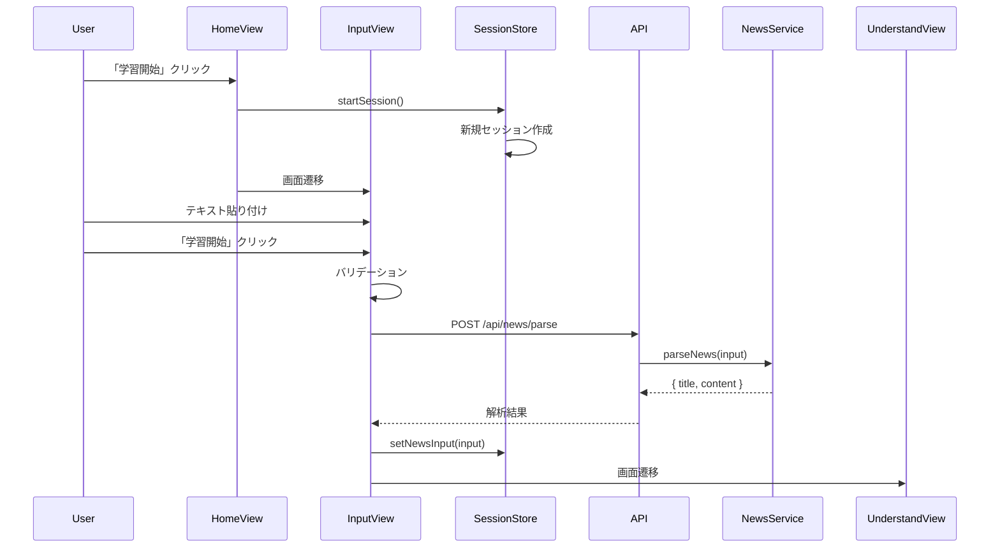
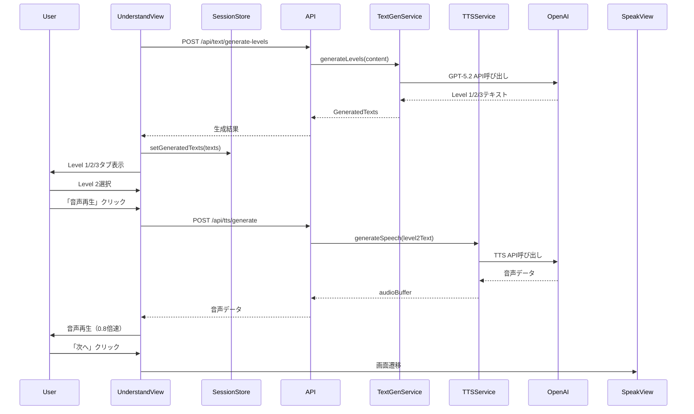
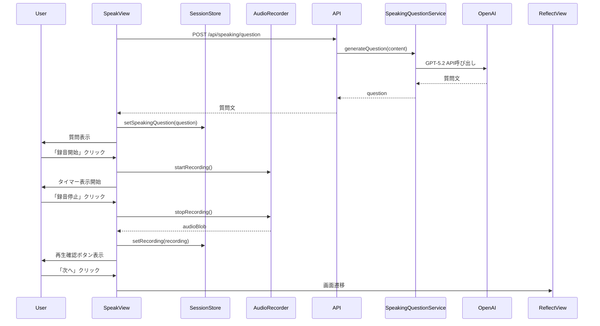
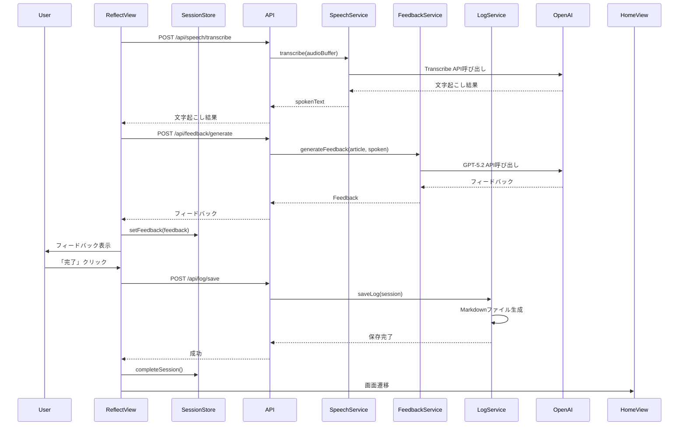
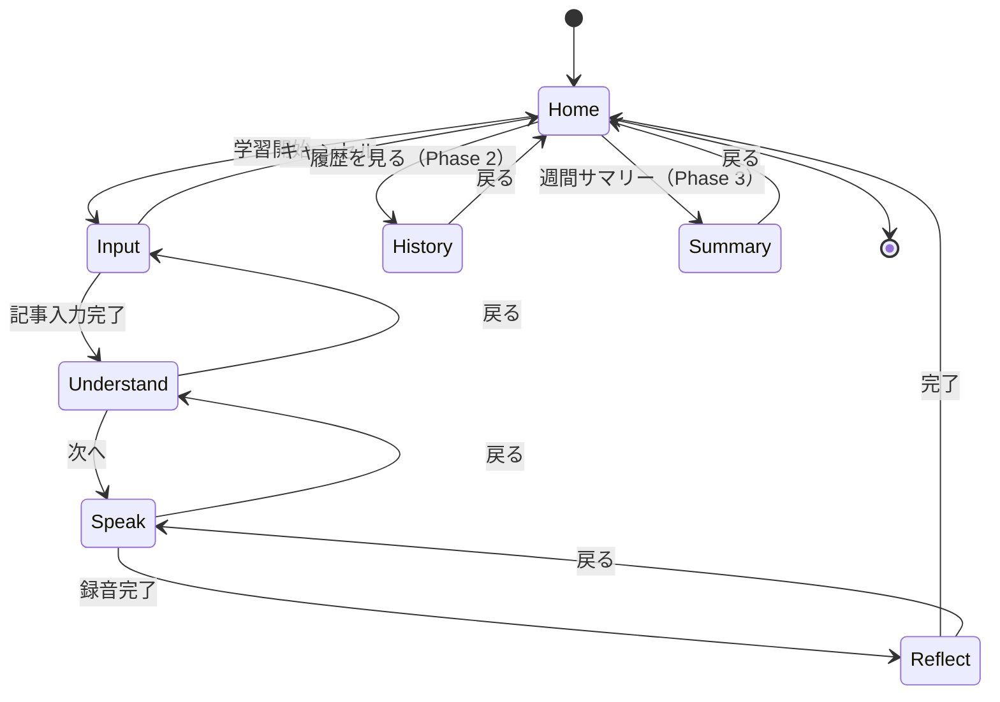

# 機能設計書 (Functional Design Document)

## システム構成図



## 技術スタック

| 分類 | 技術 | バージョン | 選定理由 |
|------|------|-----------|----------|
| 言語 | TypeScript | 5.x | 型安全性、開発効率向上 |
| ランタイム | Node.js | v24.13.0 | 最新LTS、ESM対応 |
| フロントエンド | Vue.js | 3.x | ユーザーが精通、リアクティブUI |
| バックエンド | Hono | 4.x | TypeScript対応、軽量、高速 |
| LLM | OpenAI API (GPT-5.2) | - | 要約・翻訳・フィードバック生成 |
| 音声認識 | GPT-4o mini Transcribe | - | 高精度な文字起こし |
| 音声合成 | GPT-4o mini TTS | - | 自然な音声生成 |
| データ保存 | ローカルファイル | - | シンプル、DBM不要 |

## データモデル定義

### エンティティ: LearningSession（学習セッション）

```typescript
interface LearningSession {
  id: string;                    // UUID v4
  date: string;                  // YYYY-MM-DD形式
  newsInput: NewsInput;          // ニュース入力情報
  generatedTexts: GeneratedTexts; // 生成された3レベルテキスト
  speakingQuestion: string;      // スピーキング質問
  recording?: Recording;         // 録音情報
  feedback?: Feedback;           // フィードバック情報
  createdAt: Date;               // セッション開始日時
  completedAt?: Date;            // セッション完了日時
}
```

### エンティティ: NewsInput（ニュース入力）

```typescript
interface NewsInput {
  type: 'text' | 'url';          // 入力タイプ
  content: string;               // 記事本文またはURL
  title?: string;                // 記事タイトル（自動抽出）
  sourceUrl?: string;            // 元記事URL（URL入力の場合）
}
```

### エンティティ: GeneratedTexts（生成テキスト）

```typescript
interface GeneratedTexts {
  level1: string;                // 超平易な英語（中学英語レベル）
  level2: string;                // スピーキング用の整理された英語
  level3: string;                // 原文そのまま
  level2AudioUrl?: string;       // Level 2のTTS音声URL
}
```

### エンティティ: Recording（録音）

```typescript
interface Recording {
  audioBlob: Blob;               // 録音データ（webm形式）
  duration: number;              // 録音時間（秒）
  recordedAt: Date;              // 録音日時
  filePath?: string;             // 保存先パス（永久保存時）
}
```

### エンティティ: Feedback（フィードバック）

```typescript
interface Feedback {
  spoken: string;                // 文字起こし結果（原文）
  corrected: string;             // 意味を保ったまま自然な英語に修正
  upgraded: string;              // IT業界らしい表現に引き上げ
  comment: string;               // 日本語での解説（1〜2行）
}
```

### エンティティ: LogEntry（ログエントリ）

```typescript
interface LogEntry {
  date: string;                  // YYYY-MM-DD形式
  sessions: LogSession[];        // その日の学習セッション一覧
}

interface LogSession {
  sessionNumber: number;         // その日の何回目のセッションか
  newsTitle: string;             // ニュースタイトル
  newsUrl?: string;              // ニュースURL（あれば）
  spoken: string;                // 自分の発話（原文）
  corrected: string;             // 修正版
  upgraded: string;              // IT表現版
  comment: string;               // 解説コメント
  audioFilePath?: string;        // 音声ファイルパス
  completedAt: Date;             // 完了日時
}
```

### データ関連図



## コンポーネント設計

### フロントエンド コンポーネント

#### 1. AppRouter（ルーティング）

**責務**:
- 画面遷移の管理
- 学習フローの制御

```typescript
// Vue Router設定
const routes = [
  { path: '/', name: 'Home', component: HomeView },
  { path: '/input', name: 'Input', component: InputView },
  { path: '/understand', name: 'Understand', component: UnderstandView },
  { path: '/speak', name: 'Speak', component: SpeakView },
  { path: '/reflect', name: 'Reflect', component: ReflectView },
  { path: '/history', name: 'History', component: HistoryView },      // Phase 2
  { path: '/summary', name: 'Summary', component: SummaryView },      // Phase 3
];
```

#### 2. SessionStore（状態管理）

**責務**:
- 現在の学習セッション状態の管理
- セッションデータの一時保持

```typescript
interface SessionState {
  currentSession: LearningSession | null;
  isLoading: boolean;
  error: string | null;
  audioPlaybackSpeed: number;    // デフォルト: 0.8
}

// アクション
interface SessionActions {
  startSession(): void;
  setNewsInput(input: NewsInput): void;
  setGeneratedTexts(texts: GeneratedTexts): void;
  setSpeakingQuestion(question: string): void;
  setRecording(recording: Recording): void;
  setFeedback(feedback: Feedback): void;
  completeSession(): Promise<void>;
  resetSession(): void;
}
```

#### 3. AudioRecorder（音声録音）

**責務**:
- ブラウザでの音声録音
- 録音データの管理

```typescript
class AudioRecorder {
  private mediaRecorder: MediaRecorder | null;
  private audioChunks: Blob[];

  // 録音開始
  async startRecording(): Promise<void>;

  // 録音停止
  async stopRecording(): Promise<Blob>;

  // 録音データの再生
  playRecording(blob: Blob): void;

  // 録音時間の取得
  getDuration(): number;
}
```

### バックエンド コンポーネント

#### 1. NewsService（ニュース処理）

**責務**:
- URL/テキストからの記事解析
- 記事本文の抽出

```typescript
class NewsService {
  // テキストまたはURLから記事情報を解析
  async parseNews(input: { type: 'text' | 'url'; content: string }): Promise<{
    title: string;
    content: string;
    sourceUrl?: string;
  }>;
}
```

#### 2. TextGenService（テキスト生成）

**責務**:
- 3レベルのテキスト生成（OpenAI API使用）

```typescript
class TextGenService {
  private openai: OpenAI;

  // Level 1/2/3テキストを生成
  async generateLevels(articleContent: string): Promise<GeneratedTexts>;
}
```

**プロンプト設計**:

```typescript
const LEVEL1_PROMPT = `
You are an English teacher simplifying news for beginners.
Rewrite the following news article using:
- Simple vocabulary (middle school level)
- Short sentences (under 15 words each)
- Present tense when possible
- Common everyday words

Article:
{article}

Output the simplified version only, no explanations.
`;

const LEVEL2_PROMPT = `
You are an English speaking coach.
Rewrite the following news article for speaking practice:
- Clear, organized structure
- Natural speaking rhythm
- Key points highlighted
- 150-200 words total
- Include transition words

Article:
{article}

Output the speaking-ready version only.
`;
```

#### 3. TTSService（音声生成）

**責務**:
- テキストから音声を生成（OpenAI TTS API使用）

```typescript
class TTSService {
  private openai: OpenAI;

  // テキストから音声を生成
  async generateSpeech(text: string): Promise<Buffer>;
}
```

#### 4. SpeakingQuestionService（質問生成）

**責務**:
- ニュース内容に基づいた質問の生成

```typescript
class SpeakingQuestionService {
  private openai: OpenAI;

  // スピーキング質問を生成
  async generateQuestion(articleContent: string): Promise<string>;
}
```

**プロンプト設計**:

```typescript
const QUESTION_PROMPT = `
You are an English speaking practice facilitator.
Based on the following news article, generate ONE question for speaking practice.

The question should be:
- Answerable in 30-45 seconds
- Either "explain in your own words" or "share your opinion" type
- Related to the main topic of the article
- Encouraging free expression (no right/wrong answer)

Example formats:
- "Explain this news in your own words in 30 seconds."
- "What do you think is the most important impact of this news?"
- "How might this development affect the tech industry?"

Article:
{article}

Output only the question, nothing else.
`;
```

#### 5. SpeechService（音声認識）

**責務**:
- 音声データの文字起こし（OpenAI Transcribe API使用）

```typescript
class SpeechService {
  private openai: OpenAI;

  // 音声を文字起こし
  async transcribe(audioBuffer: Buffer): Promise<string>;
}
```

#### 6. FeedbackService（フィードバック生成）

**責務**:
- 発話内容の修正・改善提案の生成

```typescript
class FeedbackService {
  private openai: OpenAI;

  // フィードバックを生成
  async generateFeedback(
    originalArticle: string,
    spokenText: string
  ): Promise<Feedback>;
}
```

**プロンプト設計**:

```typescript
const FEEDBACK_PROMPT = `
You are an English coach specializing in IT industry communication.
Analyze the following spoken response and provide feedback.

Original article context:
{article}

User's spoken response (transcribed):
{spoken}

Provide feedback in the following JSON format:
{
  "corrected": "Natural English version that preserves the original meaning",
  "upgraded": "Professional IT industry version with appropriate terminology",
  "comment": "1-2 sentences of advice in Japanese"
}

Guidelines:
- corrected: Fix grammar, word choice, and flow while keeping the meaning
- upgraded: Use IT industry terminology and professional expressions
- comment: Be encouraging, point out one specific improvement in Japanese

Output only the JSON, no markdown formatting.
`;
```

#### 7. LogService（ログ管理）

**責務**:
- 学習ログのMarkdownファイル保存
- ログの読み込み・一覧取得

```typescript
class LogService {
  private logDir: string;

  // ログを保存
  async saveLog(session: LearningSession): Promise<void>;

  // 特定日のログを取得
  async getLogByDate(date: string): Promise<LogEntry | null>;

  // ログ一覧を取得
  async listLogs(filter?: { year?: number; month?: number }): Promise<LogEntry[]>;

  // 音声ファイルを保存（Phase 2）
  async saveAudio(date: string, audioBlob: Blob): Promise<string>;
}
```

## ユースケース設計

### UC1: 学習セッション開始〜ニュース入力



### UC2: 理解フェーズ（Understand）



### UC3: スピーキングフェーズ（Speak）



### UC4: フィードバックフェーズ（Reflect）



## 画面遷移図



## 画面設計

### ホーム画面（HomeView）

```
┌─────────────────────────────────────────────────────┐
│                Daily AI News English Gym            │
├─────────────────────────────────────────────────────┤
│                                                     │
│     ┌─────────────────────────────────────────┐    │
│     │                                         │    │
│     │         🎯 今日の学習を始める            │    │
│     │                                         │    │
│     └─────────────────────────────────────────┘    │
│                                                     │
│     ┌─────────────────────────────────────────┐    │
│     │  🔥 連続学習日数: 5日                   │    │  ← Phase 3
│     └─────────────────────────────────────────┘    │
│                                                     │
│     [ 学習履歴 ]  [ 週間サマリー ]                   │  ← Phase 2/3
│                                                     │
└─────────────────────────────────────────────────────┘
```

### 入力画面（InputView）

```
┌─────────────────────────────────────────────────────┐
│  ← 戻る          ニュース入力                       │
├─────────────────────────────────────────────────────┤
│                                                     │
│  学習したいAI/ITニュースを入力してください           │
│                                                     │
│  ┌─────────────────────────────────────────────┐   │
│  │ URL入力 (Phase 2)                           │   │
│  │ ┌─────────────────────────────────────────┐ │   │
│  │ │ https://example.com/news/...            │ │   │
│  │ └─────────────────────────────────────────┘ │   │
│  └─────────────────────────────────────────────┘   │
│                                                     │
│  または                                             │
│                                                     │
│  ┌─────────────────────────────────────────────┐   │
│  │ 記事本文を貼り付け                          │   │
│  │                                             │   │
│  │                                             │   │
│  │                                             │   │
│  │                                             │   │
│  └─────────────────────────────────────────────┘   │
│                                                     │
│           [ 学習を開始する ]                        │
│                                                     │
└─────────────────────────────────────────────────────┘
```

### 理解画面（UnderstandView）

```
┌─────────────────────────────────────────────────────┐
│  ← 戻る          Understand                    1/3 │
├─────────────────────────────────────────────────────┤
│                                                     │
│  ┌──────────┬──────────┬──────────┐                │
│  │ Level 1  │ Level 2  │ Level 3  │                │
│  │ (簡単)   │(スピーキング)│ (原文)  │                │
│  └──────────┴──────────┴──────────┘                │
│                                                     │
│  ┌─────────────────────────────────────────────┐   │
│  │                                             │   │
│  │  [選択されたレベルのテキストを表示]          │   │
│  │                                             │   │
│  │  The latest AI model shows remarkable      │   │
│  │  improvements in understanding context...   │   │
│  │                                             │   │
│  │                                             │   │
│  └─────────────────────────────────────────────┘   │
│                                                     │
│  🔊 音声再生（Level 2のみ）                         │
│  ┌─────────────────────────────────────────────┐   │
│  │  ▶️ 再生  │ ⏹️ 停止  │ 速度: [0.8x ▼]       │   │
│  └─────────────────────────────────────────────┘   │
│                                                     │
│                              [ 次へ → ]            │
│                                                     │
└─────────────────────────────────────────────────────┘
```

### スピーキング画面（SpeakView）

```
┌─────────────────────────────────────────────────────┐
│  ← 戻る            Speak                       2/3 │
├─────────────────────────────────────────────────────┤
│                                                     │
│  ┌─────────────────────────────────────────────┐   │
│  │                                             │   │
│  │    "Explain this news in your own words    │   │
│  │     in 30 seconds."                        │   │
│  │                                             │   │
│  └─────────────────────────────────────────────┘   │
│                                                     │
│                                                     │
│                    ⏱️ 00:32                        │
│                    目安: 30〜45秒                   │
│                                                     │
│                                                     │
│               ┌─────────────┐                      │
│               │             │                      │
│               │     🎤      │                      │
│               │   録音中    │                      │
│               │             │                      │
│               └─────────────┘                      │
│                                                     │
│                   [ 停止 ]                         │
│                                                     │
│  ┌─────────────────────────────────────────────┐   │
│  │  ▶️ 再生確認                    [ 次へ → ]  │   │
│  └─────────────────────────────────────────────┘   │
│                                                     │
└─────────────────────────────────────────────────────┘
```

### フィードバック画面（ReflectView）

```
┌─────────────────────────────────────────────────────┐
│  ← 戻る           Reflect                      3/3 │
├─────────────────────────────────────────────────────┤
│                                                     │
│  📝 あなたの発話（文字起こし）                       │
│  ┌─────────────────────────────────────────────┐   │
│  │ The new AI model is very good at           │   │
│  │ understanding what people say...           │   │
│  └─────────────────────────────────────────────┘   │
│                                                     │
│  ✅ 修正版（自然な英語）                            │
│  ┌─────────────────────────────────────────────┐   │
│  │ The new AI model demonstrates remarkable   │   │
│  │ capability in understanding context...     │   │
│  └─────────────────────────────────────────────┘   │
│                                                     │
│  🚀 IT表現版                                        │
│  ┌─────────────────────────────────────────────┐   │
│  │ The latest LLM exhibits significant        │   │
│  │ improvements in contextual comprehension...│   │
│  └─────────────────────────────────────────────┘   │
│                                                     │
│  💡 アドバイス                                      │
│  ┌─────────────────────────────────────────────┐   │
│  │ 「very good」より「remarkable」や          │   │
│  │ 「significant」の方がフォーマルで           │   │
│  │ 専門的な印象を与えます。                    │   │
│  └─────────────────────────────────────────────┘   │
│                                                     │
│             [ 🎉 今日の学習を完了する ]             │
│                                                     │
└─────────────────────────────────────────────────────┘
```

## API設計

### POST /api/news/parse

**用途**: URL/テキストから記事を解析

**リクエスト**:
```json
{
  "type": "text",
  "content": "記事本文..."
}
```

**レスポンス**:
```json
{
  "title": "記事タイトル",
  "content": "記事本文",
  "sourceUrl": null
}
```

**エラーレスポンス**:
- 400 Bad Request: 入力が空の場合
- 422 Unprocessable Entity: URL解析に失敗した場合

---

### POST /api/text/generate-levels

**用途**: Level 1/2/3テキストを生成

**リクエスト**:
```json
{
  "content": "記事本文..."
}
```

**レスポンス**:
```json
{
  "level1": "簡単な英語...",
  "level2": "スピーキング用英語...",
  "level3": "原文..."
}
```

**エラーレスポンス**:
- 400 Bad Request: contentが空の場合
- 500 Internal Server Error: OpenAI API呼び出し失敗

---

### POST /api/tts/generate

**用途**: TTS音声を生成

**リクエスト**:
```json
{
  "text": "読み上げるテキスト..."
}
```

**レスポンス**:
- Content-Type: audio/mpeg
- Body: 音声バイナリデータ

**エラーレスポンス**:
- 400 Bad Request: textが空の場合
- 500 Internal Server Error: TTS API呼び出し失敗

---

### POST /api/speaking/question

**用途**: スピーキング質問を生成

**リクエスト**:
```json
{
  "content": "記事本文..."
}
```

**レスポンス**:
```json
{
  "question": "Explain this news in your own words in 30 seconds."
}
```

**エラーレスポンス**:
- 400 Bad Request: contentが空の場合
- 500 Internal Server Error: OpenAI API呼び出し失敗

---

### POST /api/speech/transcribe

**用途**: 音声を文字起こし

**リクエスト**:
- Content-Type: multipart/form-data
- Body: audio (file, webm形式)

**レスポンス**:
```json
{
  "text": "文字起こし結果..."
}
```

**エラーレスポンス**:
- 400 Bad Request: 音声ファイルがない場合
- 422 Unprocessable Entity: 音声形式が不正
- 500 Internal Server Error: Transcribe API呼び出し失敗

---

### POST /api/feedback/generate

**用途**: フィードバックを生成

**リクエスト**:
```json
{
  "articleContent": "記事本文...",
  "spokenText": "ユーザーの発話..."
}
```

**レスポンス**:
```json
{
  "spoken": "ユーザーの発話（そのまま）",
  "corrected": "修正版",
  "upgraded": "IT表現版",
  "comment": "日本語アドバイス"
}
```

**エラーレスポンス**:
- 400 Bad Request: 必須フィールドが不足
- 500 Internal Server Error: OpenAI API呼び出し失敗

---

### POST /api/log/save

**用途**: 学習ログを保存

**リクエスト**:
```json
{
  "date": "2025-01-21",
  "newsTitle": "記事タイトル",
  "newsUrl": null,
  "spoken": "ユーザーの発話",
  "corrected": "修正版",
  "upgraded": "IT表現版",
  "comment": "アドバイス"
}
```

**レスポンス**:
```json
{
  "success": true,
  "filePath": "/logs/2025-01/2025-01-21.md"
}
```

**エラーレスポンス**:
- 400 Bad Request: 必須フィールドが不足
- 500 Internal Server Error: ファイル書き込み失敗

---

### GET /api/log/list（Phase 2）

**用途**: ログ一覧を取得

**クエリパラメータ**:
- year (optional): 年でフィルタ
- month (optional): 月でフィルタ

**レスポンス**:
```json
{
  "logs": [
    {
      "date": "2025-01-21",
      "sessionCount": 1,
      "newsTitle": "記事タイトル"
    }
  ]
}
```

---

### GET /api/log/:date（Phase 2）

**用途**: 特定日のログを取得

**レスポンス**:
```json
{
  "date": "2025-01-21",
  "sessions": [
    {
      "sessionNumber": 1,
      "newsTitle": "記事タイトル",
      "spoken": "...",
      "corrected": "...",
      "upgraded": "...",
      "comment": "..."
    }
  ]
}
```

**エラーレスポンス**:
- 404 Not Found: 指定日のログが存在しない

---

### GET /api/summary/weekly（Phase 3）

**用途**: 週間サマリーを取得

**レスポンス**:
```json
{
  "weekStart": "2025-01-15",
  "weekEnd": "2025-01-21",
  "learningDays": 5,
  "topics": ["AI Model", "LLM", "Cloud Computing"],
  "commonExpressions": ["demonstrate", "significant"],
  "areasForImprovement": ["より具体的な例を挙げる"],
  "advice": "来週は新しい表現に挑戦してみましょう！"
}
```

## ファイル構造

### ログ保存形式

```
logs/
├── 2025-01/
│   ├── 2025-01-20.md
│   ├── 2025-01-20-audio.webm   # Phase 2
│   ├── 2025-01-21.md
│   └── 2025-01-21-audio.webm   # Phase 2
└── 2025-02/
    └── ...
```

### ログファイル形式（Markdown）

```markdown
# 2025-01-21 学習ログ

## セッション 1

**ニュース**: OpenAI Releases New Model with Enhanced Reasoning
**URL**: https://example.com/news/123

### 自分の発話（原文）
The new AI model is very good at understanding what people say and can think better than before.

### 修正版（自然な英語）
The new AI model demonstrates remarkable capability in understanding context and shows significant improvements in reasoning.

### IT表現版
The latest LLM exhibits significant advancements in contextual comprehension and demonstrates enhanced reasoning capabilities compared to its predecessors.

### アドバイス
「very good」より「remarkable」や「significant」の方がフォーマルで専門的な印象を与えます。

---

完了時刻: 2025-01-21 08:45:32
```

## エラーハンドリング

### エラー分類と対応

| エラー種別 | 発生箇所 | 処理 | ユーザーへの表示 |
|-----------|----------|------|-----------------|
| 入力バリデーションエラー | 入力画面 | 処理を中断 | 「記事を入力してください」 |
| OpenAI API接続エラー | 各サービス | 1回リトライ後エラー | 「AIサービスに接続できません。しばらく待ってから再試行してください」 |
| OpenAI APIレート制限 | 各サービス | 待機後リトライ | 「処理中です。しばらくお待ちください」 |
| 音声録音権限エラー | スピーキング画面 | 処理を中断 | 「マイクへのアクセスを許可してください」 |
| 音声形式エラー | 文字起こし | 処理を中断 | 「音声の形式が正しくありません」 |
| ファイル保存エラー | ログ保存 | リトライ | 「ログの保存に失敗しました。再試行してください」 |
| ネットワークエラー | 全般 | リトライ | 「ネットワーク接続を確認してください」 |

### リトライ戦略

```typescript
const RETRY_CONFIG = {
  maxRetries: 1,
  retryDelay: 1000,  // 1秒
  rateLimitDelay: 5000,  // 5秒
};
```

## セキュリティ考慮事項

| 項目 | 対策 |
|------|------|
| APIキー管理 | 環境変数で管理、クライアントには露出しない |
| 入力サニタイズ | ユーザー入力はサーバー側でサニタイズ |
| ローカル専用 | localhost以外からのアクセスを拒否 |
| ファイルパス | パストラバーサル攻撃を防止 |

## パフォーマンス最適化

| 項目 | 対策 |
|------|------|
| TTS音声ストリーミング | 生成完了を待たずにストリーミング再生開始 |
| テキスト生成の並列化 | Level 1/2は並列でAPI呼び出し |
| 音声データの圧縮 | webm形式で効率的に保存 |
| ローディング表示 | 全てのAPI呼び出し中はローディング表示 |

## テスト戦略

### ユニットテスト

- TextGenService: プロンプト生成、レスポンスパース
- FeedbackService: フィードバック生成ロジック
- LogService: ファイル読み書き、パス生成
- AudioRecorder: 録音開始/停止、データ取得

### 統合テスト

- 学習フロー全体: 入力→理解→スピーキング→フィードバック→保存
- API エンドポイント: リクエスト/レスポンス検証
- エラーハンドリング: 各種エラーケースの検証

### E2Eテスト

- 学習セッション完了: ユーザー視点での全フロー
- ログ保存・読み込み: データ永続化の検証
- 音声録音・再生: ブラウザ機能の検証

## 開発フェーズ別機能マップ

### Phase 1（MVP）

| 機能 | 優先度 | 状態 |
|------|--------|------|
| テキスト入力 | P0 | 対象 |
| Level 1/2/3テキスト生成 | P0 | 対象 |
| TTS音声再生 | P0 | 対象 |
| スピーキング質問生成 | P0 | 対象 |
| 音声録音 | P0 | 対象 |
| 音声文字起こし | P0 | 対象 |
| フィードバック生成 | P0 | 対象 |
| ログ保存（Markdown） | P0 | 対象 |

### Phase 2（拡張）

| 機能 | 優先度 | 状態 |
|------|--------|------|
| URL入力による記事自動取得 | P1 | 対象 |
| 音声ファイル永久保存 | P1 | 対象 |
| 履歴画面 | P1 | 対象 |

### Phase 3（継続支援）

| 機能 | 優先度 | 状態 |
|------|--------|------|
| 週間サマリー | P2 | 対象 |
| 連続日数カウント | P2 | 対象 |
