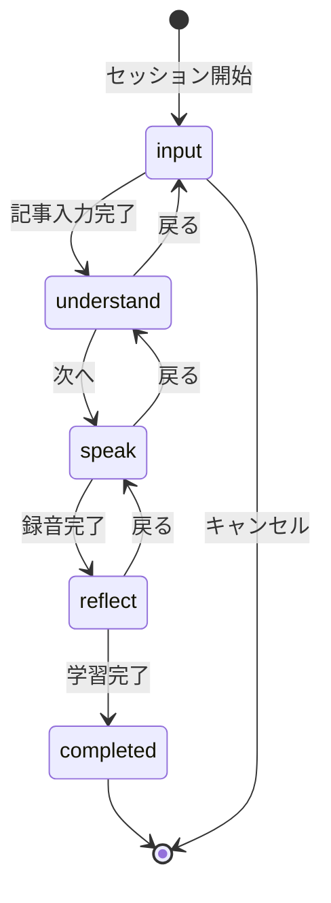

# プロジェクト用語集 (Glossary)

## 概要

このドキュメントは、Daily AI News English Gymプロジェクトで使用される用語の定義を管理します。

**更新日**: 2025-01-21

---

## ドメイン用語

プロジェクト固有のビジネス概念や機能に関する用語。

### 学習セッション (Learning Session)

**定義**: ユーザーが1回の学習で行う一連のフロー（入力→理解→スピーキング→フィードバック）の単位

**説明**:
学習セッションは、ニュース記事の入力から始まり、フィードバックの確認とログ保存で完了します。1セッションは10〜15分で完了することを想定しています。同じ日に複数のセッションを実行可能です。

**関連用語**:
- [学習ログ](#学習ログ-learning-log)
- [フェーズ](#フェーズ-phase)

**使用例**:
- 「学習セッションを開始する」: ホーム画面から「今日の学習を始める」をクリック
- 「学習セッションを完了する」: フィードバック確認後「完了」をクリック

**データモデル**: `packages/shared/src/types/session.ts`

**英語表記**: Learning Session

---

### フェーズ (Phase)

**定義**: 学習セッション内の各ステップを表す概念

**説明**:
学習セッションは4つのフェーズで構成されます:
1. **Input（入力）**: ニュース記事を入力
2. **Understand（理解）**: 3レベルのテキストで内容を理解
3. **Speak（スピーキング）**: 質問に対して英語で回答・録音
4. **Reflect（振り返り）**: AIからのフィードバックを確認

**関連用語**:
- [学習セッション](#学習セッション-learning-session)

**使用例**:
- 「Understandフェーズでは音声を聞いて内容を理解する」
- 「Speakフェーズで録音を行う」

**英語表記**: Phase

---

### Level 1/2/3 テキスト

**定義**: ニュース記事を難易度別に変換した3種類のテキスト

**説明**:
- **Level 1**: 超平易な英語（中学英語レベル）。短い文、簡単な単語
- **Level 2**: スピーキング用の整理された英語。構造化され、読み上げやすい
- **Level 3**: 原文そのまま

**関連用語**:
- [Understandフェーズ](#フェーズ-phase)
- [TTS](#tts)

**使用例**:
- 「Level 1から読み始めて、徐々にLevel 3に挑戦する」
- 「Level 2のテキストを音声で聞く」

**データモデル**: `GeneratedTexts`インターフェース

**英語表記**: Level 1/2/3 Text

---

### スピーキング質問 (Speaking Question)

**定義**: Speakフェーズでユーザーに出題される、ニュース内容に関連した質問

**説明**:
AIが記事内容に基づいて生成する質問。2種類のタイプがあります:
- 「自分の言葉で説明する」タイプ（例: "Explain this news in your own words."）
- 「意見を述べる」タイプ（例: "What do you think is the most important impact?"）

30〜45秒で回答できる内容を想定しています。

**関連用語**:
- [Speakフェーズ](#フェーズ-phase)
- [録音](#録音-recording)

**使用例**:
- 「スピーキング質問を表示する」
- 「質問に対して30秒で回答する」

**英語表記**: Speaking Question

---

### フィードバック (Feedback)

**定義**: ユーザーの発話に対するAIによる修正・改善提案

**説明**:
フィードバックは3つの要素で構成されます:
- **spoken（原文）**: ユーザーが話した内容の文字起こし
- **corrected（修正版）**: 意味を保ったまま自然な英語に修正したもの
- **upgraded（IT表現版）**: IT業界らしいプロフェッショナルな表現に引き上げたもの
- **comment（解説）**: 日本語での1〜2行のアドバイス

**関連用語**:
- [Reflectフェーズ](#フェーズ-phase)
- [文字起こし](#文字起こし-transcription)

**使用例**:
- 「フィードバックを確認して、修正版を音読する」
- 「IT表現版を覚えて次回使ってみる」

**データモデル**: `Feedback`インターフェース

**英語表記**: Feedback

---

### 録音 (Recording)

**定義**: Speakフェーズでユーザーが行う音声録音

**説明**:
ブラウザのMediaRecorder APIを使用して録音します。WebM形式で保存され、Phase 2以降では永久保存も可能です。録音時間の目安は30〜45秒です。

**関連用語**:
- [Speakフェーズ](#フェーズ-phase)
- [文字起こし](#文字起こし-transcription)

**使用例**:
- 「録音を開始する」
- 「録音を再生して確認する」

**データモデル**: `Recording`インターフェース

**英語表記**: Recording

---

### 学習ログ (Learning Log)

**定義**: 学習セッションの記録をMarkdown形式で保存したファイル

**説明**:
各セッション完了時に自動保存されます。保存先は `logs/YYYY-MM/YYYY-MM-DD.md` 形式。同じ日に複数セッションを行った場合は追記されます。

**保存内容**:
- 日付、ニュースタイトル、URL（あれば）
- ユーザーの発話（原文）
- 修正版、IT表現版
- 解説コメント
- 完了時刻

**関連用語**:
- [学習セッション](#学習セッション-learning-session)
- [フィードバック](#フィードバック-feedback)

**使用例**:
- 「学習ログを振り返る」
- 「過去のログから成長を確認する」

**ファイルパス**: `logs/YYYY-MM/YYYY-MM-DD.md`

**英語表記**: Learning Log

---

## 技術用語

プロジェクトで使用している技術・フレームワーク・ツールに関する用語。

### Vue.js

**定義**: リアクティブなUIを構築するためのJavaScriptフレームワーク

**公式サイト**: https://vuejs.org/

**本プロジェクトでの用途**:
フロントエンドのSPA（シングルページアプリケーション）を構築。Composition APIを使用してリアクティブな状態管理を実現しています。

**バージョン**: 3.x

**選定理由**: ユーザーが精通している技術であり、軽量で高速

**関連ドキュメント**: [アーキテクチャ設計書](./architecture.md)

**設定ファイル**: `packages/frontend/vite.config.ts`

---

### Hono

**定義**: 軽量・高速なWebフレームワーク（TypeScript対応）

**公式サイト**: https://hono.dev/

**本プロジェクトでの用途**:
バックエンドAPIサーバーとして使用。各種エンドポイント（/api/text, /api/tts, /api/feedback等）を提供します。

**バージョン**: 4.x

**選定理由**: TypeScript完全対応、軽量（依存なし）、Web標準準拠でテストしやすい

**関連ドキュメント**: [アーキテクチャ設計書](./architecture.md)

**設定ファイル**: `packages/backend/src/index.ts`

---

### OpenAI API

**定義**: OpenAI社が提供するAI機能のAPI

**公式サイト**: https://platform.openai.com/

**本プロジェクトでの用途**:
- **GPT-5.2**: テキスト生成（Level 1/2テキスト、質問、フィードバック）
- **GPT-4o mini TTS**: 音声合成（Level 2テキストの読み上げ）
- **GPT-4o mini Transcribe**: 音声認識（録音の文字起こし）

**バージョン**: API v4.x (SDK)

**関連ドキュメント**: [機能設計書](./functional-design.md)

**設定**: 環境変数 `OPENAI_API_KEY`

---

### Pinia

**定義**: Vue.js用の状態管理ライブラリ

**公式サイト**: https://pinia.vuejs.org/

**本プロジェクトでの用途**:
学習セッションの状態（現在のフェーズ、入力データ、生成テキスト、フィードバック等）を管理します。

**バージョン**: 2.x

**関連ドキュメント**: [リポジトリ構造定義書](./repository-structure.md)

**設定ファイル**: `packages/frontend/src/stores/session.ts`

---

### Vitest

**定義**: Viteベースの高速テストフレームワーク

**公式サイト**: https://vitest.dev/

**本プロジェクトでの用途**:
ユニットテストと統合テストの実行。Jest互換APIを持ち、TypeScript/ESMをネイティブサポートします。

**バージョン**: 2.x

**関連ドキュメント**: [開発ガイドライン](./development-guidelines.md#テスト戦略)

**設定ファイル**: `vitest.config.ts`

---

### Playwright

**定義**: クロスブラウザ対応のE2Eテストフレームワーク

**公式サイト**: https://playwright.dev/

**本プロジェクトでの用途**:
学習フロー全体のエンドツーエンドテストを実行。Chrome（ヘッドレス）での自動テストを行います。

**バージョン**: 1.x

**関連ドキュメント**: [開発ガイドライン](./development-guidelines.md#e2eテスト)

**設定ファイル**: `tests/playwright.config.ts`

---

## 略語・頭字語

### TTS

**正式名称**: Text-to-Speech

**意味**: テキストを音声に変換する技術

**本プロジェクトでの使用**:
Level 2テキストの音声読み上げに使用。OpenAI GPT-4o mini TTSを利用しています。再生速度のデフォルトは0.8倍です。

**実装**: `packages/backend/src/services/TTSService.ts`

---

### STT / Transcribe

**正式名称**: Speech-to-Text / Transcription

**意味**: 音声をテキストに変換する技術（文字起こし）

**本プロジェクトでの使用**:
ユーザーの録音を文字起こしするために使用。OpenAI GPT-4o mini Transcribeを利用しています。

**実装**: `packages/backend/src/services/SpeechService.ts`

---

### SPA

**正式名称**: Single Page Application

**意味**: 単一のHTMLページで動作し、画面遷移をJavaScriptで制御するWebアプリケーション

**本プロジェクトでの使用**:
フロントエンドはVue.jsによるSPAとして構築。Vue Routerで画面遷移を管理します。

**実装**: `packages/frontend/`

---

### API

**正式名称**: Application Programming Interface

**意味**: アプリケーション間でデータをやり取りするためのインターフェース

**本プロジェクトでの使用**:
フロントエンドとバックエンド間の通信、およびOpenAI APIとの連携に使用します。

**エンドポイント例**: `/api/text/generate-levels`, `/api/feedback/generate`

---

### MVP

**正式名称**: Minimum Viable Product

**意味**: 最小限の機能を持つ実用可能な製品

**本プロジェクトでの使用**:
Phase 1で実装する基本機能セットを指します。テキスト入力、Level生成、TTS、録音、文字起こし、フィードバック、ログ保存が含まれます。

**関連**: [PRD](./product-requirements.md#コア機能mvp---phase-1)

---

## アーキテクチャ用語

### レイヤードアーキテクチャ (Layered Architecture)

**定義**: システムを役割ごとに複数の層に分割し、上位層から下位層への一方向の依存関係を持たせる設計パターン

**本プロジェクトでの適用**:
```
UIレイヤー（Vue.js）
    ↓
APIレイヤー（Hono Router）
    ↓
サービスレイヤー（ビジネスロジック）
    ↓
アダプターレイヤー（外部依存）
```

**メリット**:
- 関心の分離による保守性向上
- 各層を独立してテスト可能
- 変更の影響範囲が限定的

**依存関係ルール**:
- ✅ 上位 → 下位
- ❌ 下位 → 上位

**関連ドキュメント**: [アーキテクチャ設計書](./architecture.md#レイヤードアーキテクチャ)

---

### モノレポ (Monorepo)

**定義**: 複数のパッケージ/プロジェクトを単一のリポジトリで管理する手法

**本プロジェクトでの適用**:
npm workspacesを使用して、frontend/backend/sharedの3パッケージを管理しています。

```
packages/
├── frontend/    # @daily-english-gym/frontend
├── backend/     # @daily-english-gym/backend
└── shared/      # @daily-english-gym/shared
```

**メリット**:
- 型定義の共有が容易
- 一括でのビルド・テスト
- 依存関係の一元管理

**関連ドキュメント**: [リポジトリ構造定義書](./repository-structure.md)

---

### Composable

**定義**: Vue 3のComposition APIを使用した再利用可能なロジックの単位

**本プロジェクトでの適用**:
`use`プレフィックスを持つ関数として実装。状態とロジックをカプセル化します。

**例**:
- `useAudioRecorder`: 音声録音機能
- `useAudioPlayer`: 音声再生機能
- `useApi`: API呼び出しの共通処理

**実装**: `packages/frontend/src/composables/`

---

## ステータス・状態

### セッション状態 (Session Status)

**定義**: 学習セッションの進行状態を表す列挙型

**取りうる値**:

| ステータス | 意味 | 遷移条件 | 次の状態 |
|----------|------|---------|---------|
| `input` | 入力中 | セッション開始 | `understand` |
| `understand` | 理解中 | ニュース入力完了 | `speak` |
| `speak` | スピーキング中 | 理解フェーズ完了 | `reflect` |
| `reflect` | 振り返り中 | 録音完了 | `completed` |
| `completed` | 完了 | フィードバック確認・保存 | - |

**状態遷移図**:


**実装**: `packages/shared/src/types/session.ts`

---

## データモデル用語

### LearningSession（学習セッション）

**定義**: 1回の学習フローを表すエンティティ

**主要フィールド**:
- `id`: セッションID（UUID v4）
- `date`: 日付（YYYY-MM-DD）
- `newsInput`: ニュース入力情報
- `generatedTexts`: 生成された3レベルテキスト
- `speakingQuestion`: スピーキング質問
- `recording`: 録音情報（オプション）
- `feedback`: フィードバック情報（オプション）
- `createdAt`: セッション開始日時
- `completedAt`: セッション完了日時（オプション）

**関連エンティティ**: NewsInput, GeneratedTexts, Recording, Feedback

**実装**: `packages/shared/src/types/session.ts`

---

### GeneratedTexts（生成テキスト）

**定義**: ニュース記事から生成された3レベルのテキストを保持するエンティティ

**主要フィールド**:
- `level1`: 超平易な英語（中学英語レベル）
- `level2`: スピーキング用の整理された英語
- `level3`: 原文そのまま
- `level2AudioUrl`: Level 2のTTS音声URL（オプション）

**関連エンティティ**: LearningSession

**実装**: `packages/shared/src/types/session.ts`

---

## エラー・例外

### ValidationError

**クラス名**: `ValidationError`

**発生条件**: ユーザー入力がバリデーションルールに違反した場合

**対処方法**:
- ユーザー: エラーメッセージに従って入力を修正
- 開発者: バリデーションロジックが正しいか確認

**例**:
```typescript
throw new ValidationError(
  '記事を入力してください',
  'content',
  ''
);
```

**実装箇所**: `packages/shared/src/types/errors.ts`

---

### OpenAIError

**クラス名**: `OpenAIError`

**発生条件**: OpenAI API呼び出しが失敗した場合（接続エラー、レート制限等）

**対処方法**:
- ユーザー: しばらく待ってから再試行
- 開発者: APIキー設定、ネットワーク接続を確認

**例**:
```typescript
throw new OpenAIError(
  'テキスト生成に失敗しました',
  503,
  originalError
);
```

**実装箇所**: `packages/shared/src/types/errors.ts`

---

### FileStorageError

**クラス名**: `FileStorageError`

**発生条件**: ファイル読み書きが失敗した場合

**対処方法**:
- ユーザー: ディスク容量、権限を確認
- 開発者: ファイルパス、権限設定を確認

**例**:
```typescript
throw new FileStorageError(
  'ログの保存に失敗しました',
  '/logs/2025-01/2025-01-21.md',
  originalError
);
```

**実装箇所**: `packages/shared/src/types/errors.ts`

---

## 索引

### あ行
- [アーキテクチャ](#レイヤードアーキテクチャ-layered-architecture) - アーキテクチャ用語

### か行
- [学習セッション](#学習セッション-learning-session) - ドメイン用語
- [学習ログ](#学習ログ-learning-log) - ドメイン用語
- [Composable](#composable) - アーキテクチャ用語

### さ行
- [スピーキング質問](#スピーキング質問-speaking-question) - ドメイン用語
- [セッション状態](#セッション状態-session-status) - ステータス

### た行
- [TTS](#tts) - 略語

### は行
- [フィードバック](#フィードバック-feedback) - ドメイン用語
- [フェーズ](#フェーズ-phase) - ドメイン用語

### ま行
- [モノレポ](#モノレポ-monorepo) - アーキテクチャ用語
- [MVP](#mvp) - 略語

### ら行
- [Level 1/2/3 テキスト](#level-123-テキスト) - ドメイン用語
- [レイヤードアーキテクチャ](#レイヤードアーキテクチャ-layered-architecture) - アーキテクチャ用語
- [録音](#録音-recording) - ドメイン用語

### A-Z
- [API](#api) - 略語
- [Hono](#hono) - 技術用語
- [OpenAI API](#openai-api) - 技術用語
- [Pinia](#pinia) - 技術用語
- [Playwright](#playwright) - 技術用語
- [SPA](#spa) - 略語
- [STT](#stt--transcribe) - 略語
- [Vitest](#vitest) - 技術用語
- [Vue.js](#vuejs) - 技術用語
